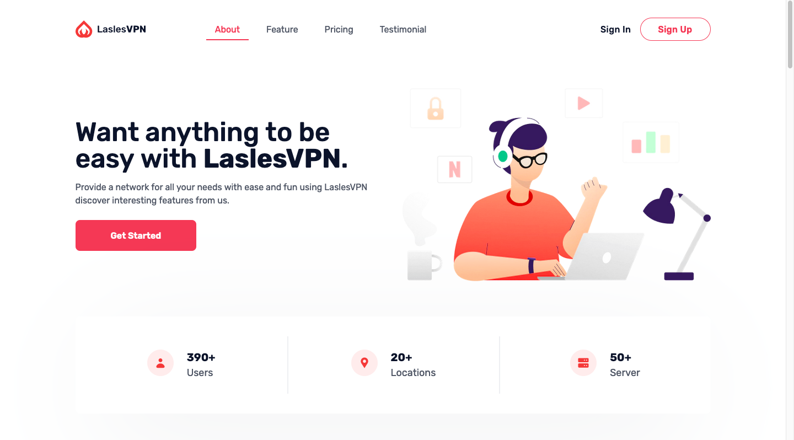

# [Tailwind VPN Landingpage](https://next-landing-vpn.vercel.app/) - Landingpage Template Apps

Tailwind VPN Landingpage is an open source, apps landing page template for [Tailwind CSS](https://tailwindcss.com/) and[ NextJS](nextjs.org/).

## Getting Started

## About the Template

- Template building using NextJS Version 10
- Tailwind v2.0

## Feature Template

- Using [NextJS Image](https://nextjs.org/docs/api-reference/next/image) for Image Optimization
- Slider using [React Slick](https://react-slick.neostack.com/docs/api)
- Smooth Scrolling and Active menu using [React Scroll](https://www.npmjs.com/package/react-scroll)

## Copyright and License

Code released under the MIT license.

## To Do List Add Feature

- [ ] Animation using Framer Motion
